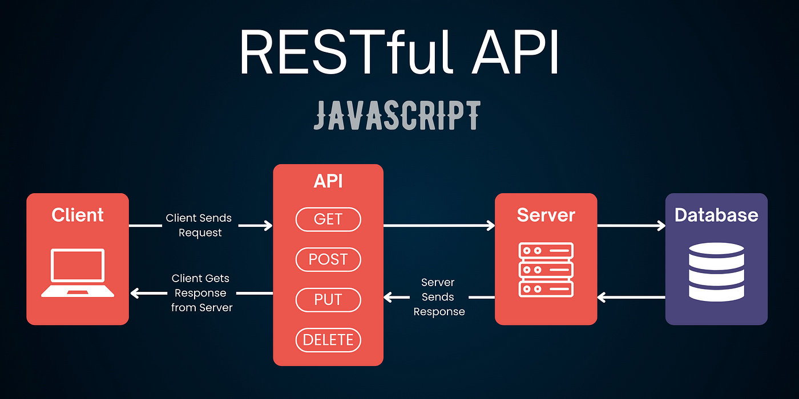
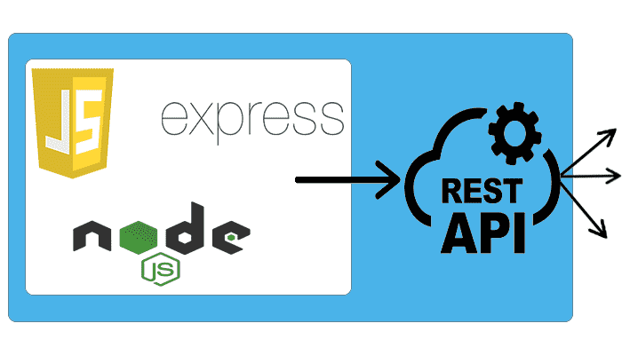

<h2>This combination</h2>

<h2>Docker compose</h2>

<br/>

<h2>Clarifai API</h2>

<br/>

<h2>React</h2>

<br/>

<h2>Node.js</h2>

<br/>

<h2>Node.js File System module</h2>

<br/>

<h2>Node.js puppeteer</h2>

<br/>

<h2>Express</h2>

<br/>

<h2>Express</h2>

<br/>

<h2>PostgreSQL</h2>

<br/>


##
##
## Start testing this Docker-compose app
```bash
git clone https://github.com/PhoenixYork166/Docker-compose.git
```

```bash
cd Docker-compose
```

## Watch out...We'll need to wait for 3 minutes after
## docker-compose up -d;
## for Node.js => PostgreSQL microservices to start working properly
##
## 1. Start Docker-compose
```bash
docker-compose up -d;
```

##
##
## 2. Check currently running containers
```bash
docker ps -a;
```

##
##
## 3. Inspecting any docker containers status (Frontend/Backend/Database) via logs
## Inspecting Frontend (React.js) container status
```bash
docker logs ai-frontend;
```
## Inspecting Backend (Node.js) container status
```bash
docker logs ai-backend;
```
## Inspecting Database (Postgres) container status
```bash
docker logs ai-postgres;
```

##
##
## 4. Database Administration (Postgres)
## You may enter PostgreSQL database shell (psql) environment for database administration

## This Docker composed Full Stack app mounts PostgreSQL TCP Port 5433
## Instead of TCP Port 5432 on your host machine (macOS/Windows/AWS EC2)
## PostgreSQL password: rootGor
```bash
psql -U postgres -d smart-brain -h 127.0.0.1 -p 5433;
```

## Should you have created any new tables

## Please put all CREATE TABLE .sql files 
## into 
## projectFolder/postgresql/postgres-init/init.sql
## Line 86 -- NEW CREATE TABLE SQL here

## Thus, next time when you recreate this Docker-compose app on other host machines using 
```bash
docker-compose up -d;
```
## You'll have all your postgres tables ready

##
##
## 5. Stop Docker-compose
```bash
docker-compose down;
```

##
##
## 6. Code changes
## You may add on custom features to this Full Stack app
## Rebuild all docker images for this app
```bash
docker-compose down;
docker-compose up --build;
```

##
##
## 7. Should you want to start fresh without any existing docker images & docker containers on your host machine 
## Watch out! This will remove all existing docker images on your host!
```bash
docker-compose down;
bash ./prune-before-docker-compose-up.sh;
```
